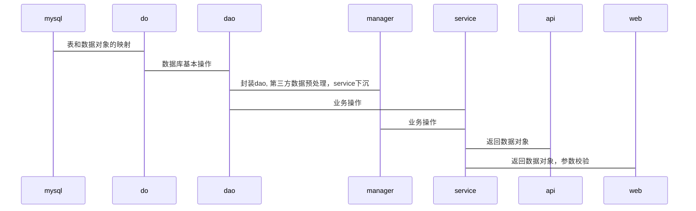

# 整站梳理

| 修订版本 | 修订内容  | 修订人员 | 文档类型 | 修订日期 |
| :-----: |  :-----:  | :-----: | :-----: | :-----: |
|  v1.0.1.* | 新建reference | sid | -- | 2018-12-16 |
|  v1.1.1.* | 重新规划设计 | sid | -- | 2018-12-30 |
| ————— | —————————————————————————— | ————— | ————— | —————— |

版本号说明

* 版本号第四位: 修剪文档语句结构、内容布局，不计入修订版本。
* 版本号第三位: 二级模块内容、结构进行更新，计入修订版本。
* 版本号第二位: 一级模块内容、结构进行更新，计入修订版本。
* 版本号第一位: 不限于整个文档进行升级、包含的内容同时进行版本迭代，计入修订版本并生成新的文档。

修改文档名为：
1.快照版（同布更新）
2.稳定版（只维护，不更新）
3.最终版（不更新、不维护）

---

## 顶层设计

使用者的思考

* 网站开发其实就是下面该逻辑表达式求解的过程：[WHO] —》 [WHEN] —》 [HOW] —》 [WHAT] === [STATE]

## 功能实现

### database设计

* 三范式和反范式
* 业务级联

### DAO & DO

DAO层主要实现RPC接口, 编写mapper

* sql实现增删改查
* sql执行结果与DO层绑定
* 封装数据实体

具体技术

* proto数据转换，跨语言操作数据库
* 数据库存储过程   
* redis缓存集群，消息队列

测试

* AIR模型
* 获取数据库操作结果
* 验证数据库连接、操作是否正常

### Manager & VO & DTO

Manager层主要实现RPC接口, 通用业务层

* 组合DAO层的数据为VO数据，DTO对象，与三方平台数据交互
* 第三方平台数据封装、预处理、转换异常信息
* service能力下沉，缓存处理、中间件
* 包装异常信息并上抛
* 开始记录日志

具体技术

* 枚举封装常量、异常信息
* 多态封装接口
* Slf4j日志五个级别：error/info/warn/fatal/debug 来包装错误信息
* 通过配置日志的不同级别来输出事故现场信息的logs文件(部分信息)

Manager层测试

* BCDE模型
* 验证三方数据输入、dao层输出是否正确
* 根据传参返回不同的数据包、打印日志
* 响应请求结果

### Service & VO & DTO

Service层主要实现RPC接口

* Manager层拼接逻辑实现（操作接口）数据为VO、DTO对象
* 业务拼接逻辑实现（行为接口）对应VO层（方便Service返回数据的一个封装，行为结果，成功失败的原因）
* 截获manager层上抛的异常信息，并输出最终日志。
* 系统性能监测
* 数据统计
* 定时任务

具体技术

* 枚举封装常量
* 多态封装接口
* 日志最终截获层，输出日志

Service层测试

* 验证数据输出是否正确
* 根据传参返回不同的数据包
* 响应请求结果

### WEB

Web层主要实现RESTful接口和请求转发

* 参数校验
* 鉴权控制
* 疲劳度控制
* 转义数据
* 处理POST请求
* 请求控制转发,Service或Server层

### API层

API层主要实现RPC, 通过WEB层实现RESTful接口

* 返回GET请求，下沉POST请求到WEB层
* 数据过滤
* CSRF校验
* 鉴权控制
* 网关控制
* 流量控制

根据不同的业务输出不同的数据格式

### Client层

PC、WAP、APP三端

PC
Jquery-1.12.4 + CSS3 + H5
为了兼容到IE678，尽量少写花里胡哨的CSS3效果，毕竟重绘也有性能代价。必要时进行优雅降级

WAP
VUE + VUEX + vue-router

## 数据流程图

