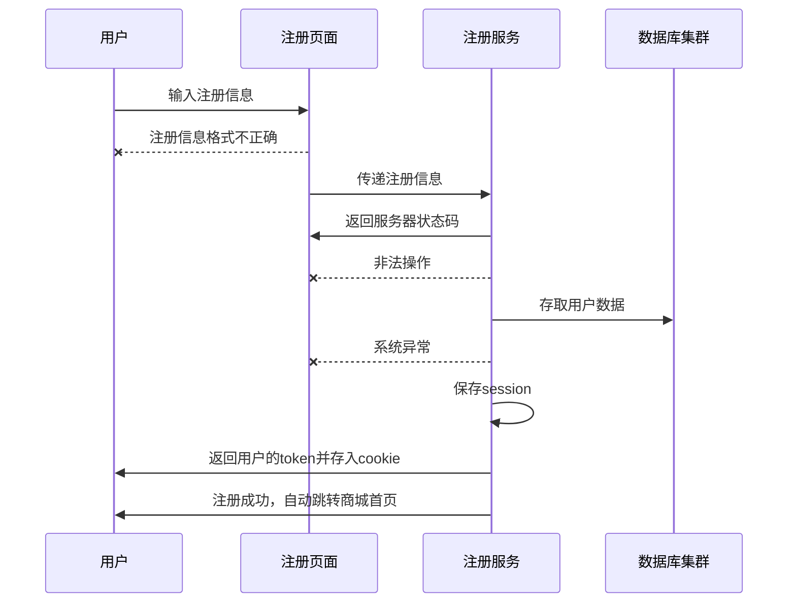
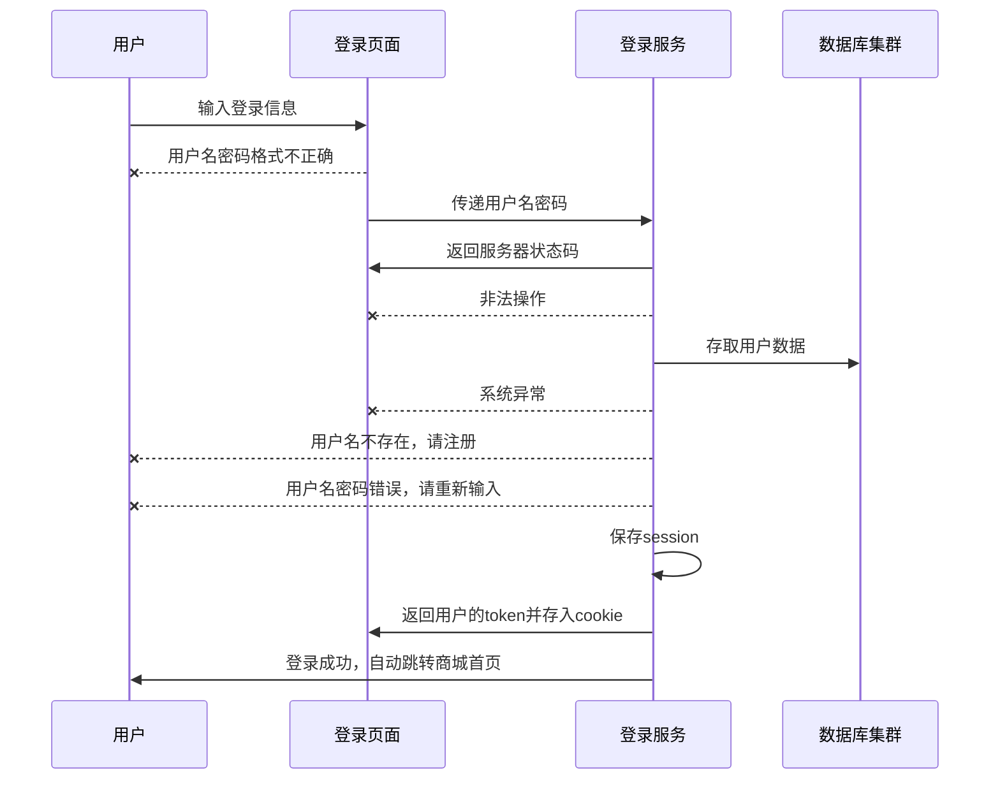
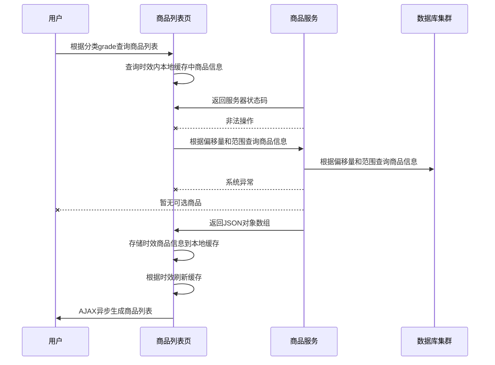
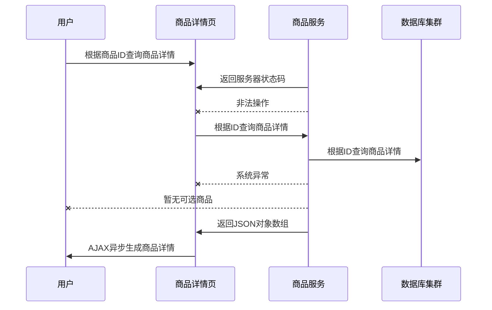
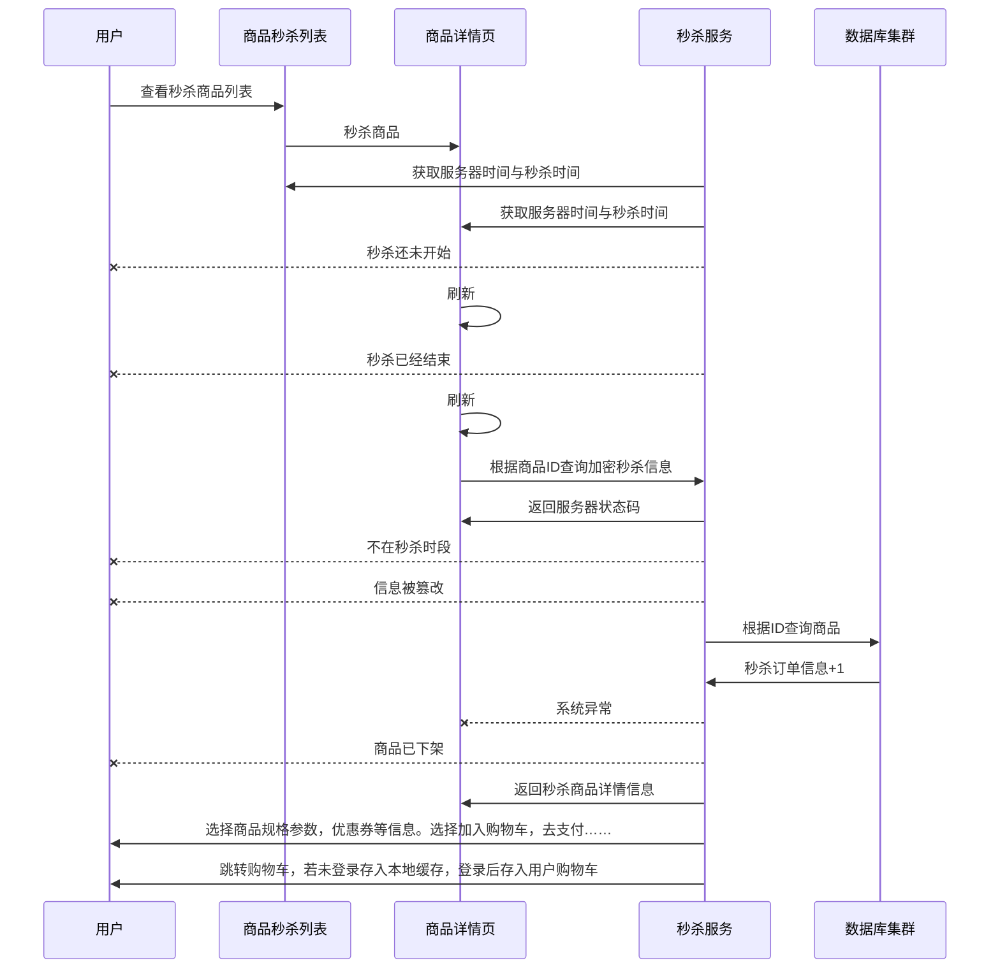
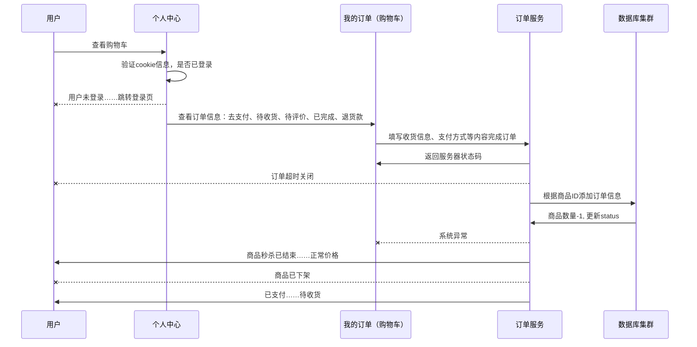

# 商城秒杀业务实现心得以及优化规划

| 修订版本 | 修订内容  | 修订人员 | 文档类型 | 修订日期 |
| :-----: |  :-----:  | :-----: | :-----: | :-----: |
|  v1.0.1.* | 新建商城秒杀业务实现心得以及优化规划 | sid | -- | 2018-12-04 |
| ————— | —————————————————————————— | ————— | ————— | —————— |

版本号说明

* 版本号第四位: 修剪文档语句结构、内容布局，不计入修订版本。
* 版本号第三位: 二级模块内容、结构进行更新，计入修订版本。
* 版本号第二位: 一级模块内容、结构进行更新，计入修订版本。
* 版本号第一位: 不限于整个文档进行升级、包含的内容同时进行版本迭代，计入修订版本并生成新的文档。

修改文档名为：
1.快照版（同布更新）
2.稳定版（只维护，不更新）
3.最终版（不更新、不维护）

---

## 内容简介

* [1 业务功能](##业务功能)
* [1.1 流程简介](###流程简介)
* [1.2 注册登录](###注册登录)
* [1.3 商品查询](###商品查询)
* [1.4 商品下单](###商品下单)
* [1.5 订单支付](###订单支付)
* [1.6 订单查询](###订单查询)
* [1.7 订单评价](###订单评价)
* [2 数据设计](##数据设计)

## 业务功能

### 流程简介

### 注册登录

### 商品查询

### 商品下单

### 订单支付

### 订单查询

### 订单评价

### 仓储

### 积分

## 数据设计
