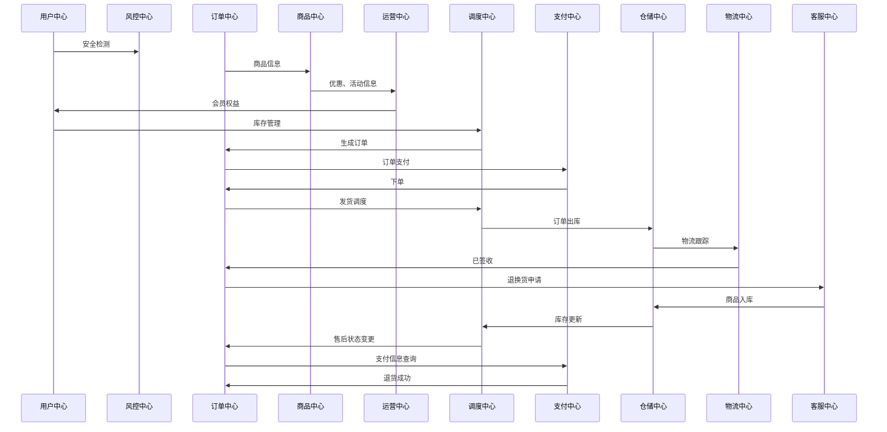

# 3ae-mall项目介绍

| 修订版本 | 修订内容  | 修订人员 | 文档类型 | 修订日期 |
| :-----: |  :-----:  | :-----: | :-----: | :-----: |
|  v1.0.1.* | 3ae-mall项目介绍 | sid | -- | 2018-12-04 |
| ————— | —————————————————————————— | ————— | ————— | —————— |

版本号说明

* 版本号第四位: 修剪文档语句结构、内容布局，不计入修订版本。
* 版本号第三位: 二级模块内容、结构进行更新，计入修订版本。
* 版本号第二位: 一级模块内容、结构进行更新，计入修订版本。
* 版本号第一位: 不限于整个文档进行升级、包含的内容同时进行版本迭代，计入修订版本并生成新的文档。

修改文档名为：
1.快照版（同布更新）
2.稳定版（只维护，不更新）
3.最终版（不更新、不维护）

---

## 主架构

```utf-8
架构图 3ae-mall

  3ae-mall
    ├── public                                        // 全局静态资源
    ├── script                                        // 脚本资源
    ├── src
    │    ├── assets
    │    │     ├── utils                              // 工具
    │    │     └── static                             // 静态资源
    │    ├── config                                   // 公共配置
    │    ├── docker                                   // docker容器、码头工人; doctor装配文件(Vt. 装配，假造，修改)
    │    │     ├── model
    │    │     │     ├── api                          // 后台api
    │    │     │     └── store                        // vuex
    │    │     ├── views
    │    │     │     ├── components                   // 组件
    │    │     │     ├── pages
    │    │     │     │     ├── caution                // 警示 (报错信息、状态码、数据异常等)
    │    │     │     │     └── filler                 // 填充 (过渡页、流程页、信息页、介绍页)
    │    │     │     └── service                      // 业务
    │    │     └── vitae
    │    │           ├── routes                       // 动态路由
    │    │           ├── index.js                     // 路由配置
    │    │           └── permission.js                // 许可证
    │    ├── app.vue                                  // 应用入口
    │    ├── main.js                                  // 挂载VUE
    │    └── router.js                                // 路由入口
    ├── test                                          // 测试
    ├── .editorconfig                                 // 代码风格配置
    ├── .eslintignore                                 // eslint 忽略目录配置
    ├── .eslintrc                                     // eslint 配置
    ├── generator.json                                // generator.json
    ├── package.json                                  // package.json
    ├── README.md                                     // 项目说明
    └── yarn.lock                                     // 模板版本管理
```

## 网站业务流程图

