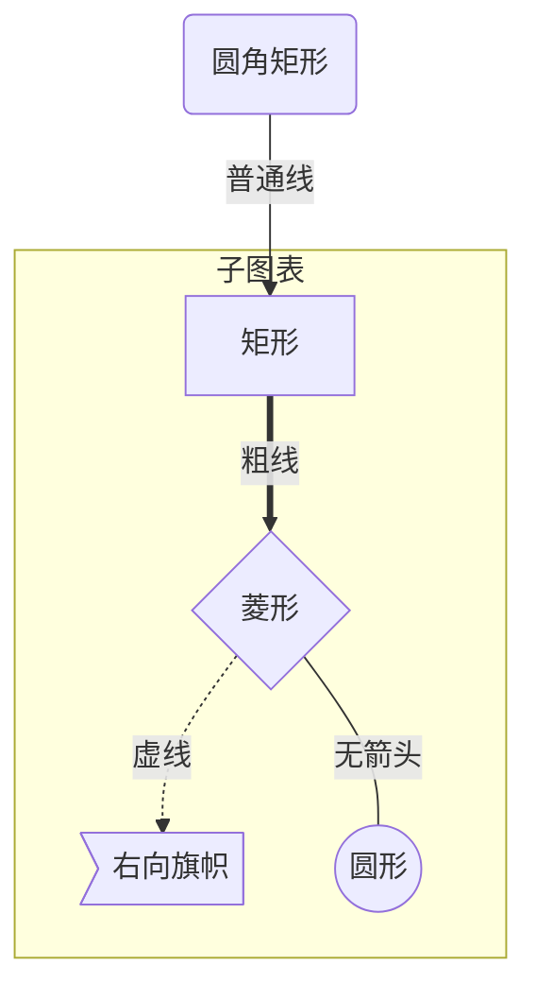
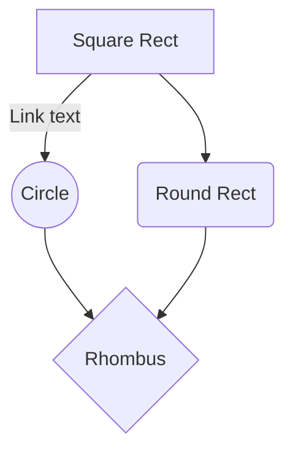
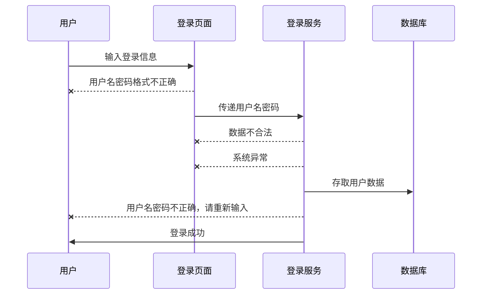
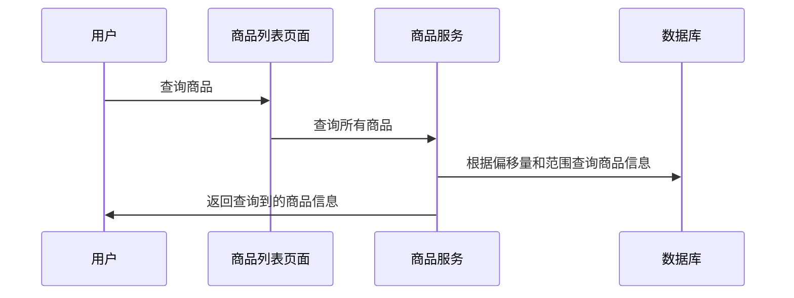
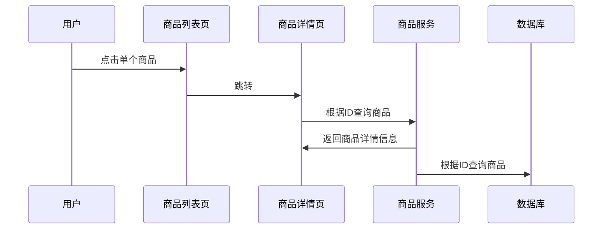
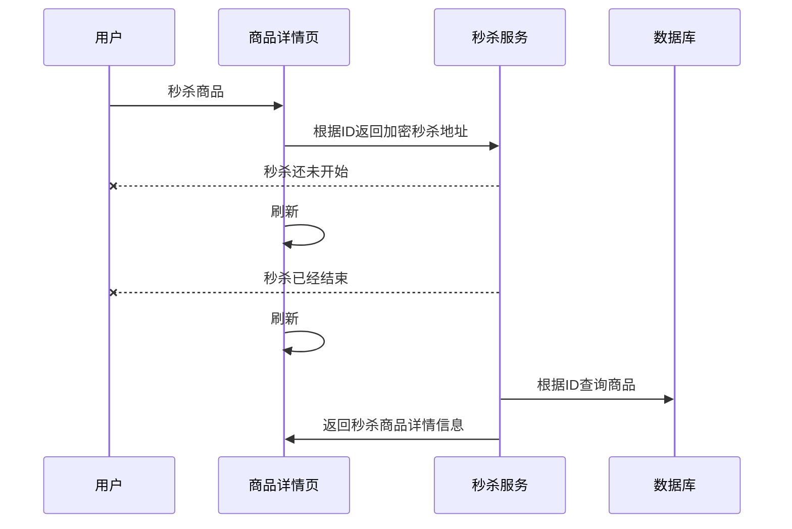

# 南京睿实rd59项目————代码分析

--------------------------------

## 先放一张小图片


## 9月5号

目录结构如下（E:\version\njrs_rd59\rd59___2018.9.5）

    ```

        rd59-debug                                          主目录
            config                                                  配置目录
                config.properties                                           配置参数
                logo.jpg                                                    公司logo
                parse.properties                                            消防报警参数
            src                                                     代码目录
                main                                                        主目录
                    java->com->njrs->rd59                                       com.njrs.rd59
                        agent                                                           agent
                            parse                                                           参数
                                impl->tcp                                                       tcp参数
                                    Parse1.java                                                     设备序列号解析
                                AbstractParse.java                                                  报文解析父类
                                ParseFactory.java                                                   报文解析工厂
                            AgentServer.java                                                    Agent服务
                            AgentTcpHandler.java                                                TCP通信Handler
                        constants                                                       constants
                            ErrorCode.java                                                  错误码
                        util
                            DataUtil.java                                                   数据处理
                            PropertyUtil.java                                               properties文件解析
                        window
                            MainFrame.java                                                  主界面
                    resources
                test
            target
            logback.xml                                             日志文件
            pom.xml                                                 pom文件
    ```

## 9月10号

目录结构如下（E:\version\njrs_rd59\rd59___2018.9.10_0.0.3）

    ```

        rd59-debug                                          主目录
            config                                                  配置目录
                config.properties                                           配置参数
                logo.jpg                                                    公司logo
                parse.properties                                            消防报警参数
            src                                                     代码目录
                main                                                        主目录
                    java->com->njrs->rd59                                       com.njrs.rd59
                        agent                                                           agent（代理）
                            parse                                                           参数
                                impl->tcp                                                       impl->tcp参数
                                    ++DenyReply.java                                                ++否认回复
                                        Parse1.java                                                     设备序列号解析
                                    ++Parse0.java                                                   ++设备注册
                                    AbstractParse.java                                              报文解析父类
                                    ParseFactory.java                                               报文解析工厂
                            AgentServer.java                                                    Agent服务
                            AgentTcpHandler.java                                                TCP通信Handler
                        constants                                                       constants（常量）
                        ++Constants.java                                                ++公共常用类
                            ErrorCode.java                                                  错误码
                        ++GlobalData.java                                               ++全局数据
                        util                                                            util（工具）
                            DataUtil.java                                                   数据处理
                        ++NetWorkUtil.java                                              ++网络
                            PropertyUtil.java                                               properties文件解析
                        window
                        ++CameraPanel.java                                              ++视频
                        ++ComTabPanel.java                                              ++tab组件
                            MainFrame.java                                                  主界面
                        ++ObjType0Panel.java                                            ++消防设施注册
                    resources
                        ++logback.xml                                             日志文件
                test
            target
        --logback.xml                                             日志文件
            pom.xml                                                 pom文件
    ```

## 程序流程

测试当前Markdown是否支持流程图  
rd59-debug  

```flow

    st=>start: main start
    load_conf_files=>subroutine: 加载配置文件
    port=>operation: 获取配置文件端口号
    UI_manager=>subroutine: 加载窗口配置
    is_TCPbind=>condition: TCP连接
    agent_server=>subroutine: 启动代理服务器
    is_ret=>condition: 服务启动
    main_run=>subroutine: 主窗口启动
    try_catch=>condition: 不异常

    logger_start_OK=>operation: 日志输出启动成功
    logger_error=>operation: 日志输出错误
    e=>end

    st->load_conf_files->port->UI_manager->is_TCPbind
    is_TCPbind(false)->logger_error->e
    is_TCPbind(true)->agent_server->is_ret
    is_ret(false)->logger_error->e
    is_ret(true)->logger_start_OK
    is_ret(true)->main_run
    main_run->try_catch
    try_catch(false)->logger_error->e
    try_catch(true)->e
```

```flow

    st=>start: main_run start
    load_logger=>subroutine: 实例化日志类
    logger_conf=>operation: 设置日志参数
    main_frame=>subroutine: 主面板框架
    tab_panel=>subroutine: 实例化窗格
    get_log_pane=>subroutine: 获取日志框
    dimension=>operation: 获取内容尺寸
    event=>operation: 关闭事件
    log=>operation: 获取监听日志
    set_log=>operation: 设置日志
    logger_info=>operation: 日志信息

    logger_start_OK=>operation: 日志输出启动成功
    logger_error=>operation: 日志输出错误
    e=>end

    st->load_logger->logger_conf->main_frame
    main_frame->log->set_log->logger_info->e
    tab_panel->get_log_pane->dimension->event->log
```

```flow

    st=>start: main_run start
    load_logger=>subroutine: 实例化日志类
    logger_conf=>operation: 设置日志参数
    main_frame=>subroutine: 主面板框架
    tab_panel=>subroutine: 实例化窗格
    get_log_pane=>subroutine: 获取日志框
    dimension=>operation: 获取内容尺寸
    event=>operation: 关闭事件
    log=>operation: 获取监听日志
    set_log=>operation: 设置日志
    logger_info=>operation: 日志信息

    logger_start_OK=>operation: 日志输出启动成功
    logger_error=>operation: 日志输出错误
    e=>end

    st->load_logger->logger_conf->main_frame
    main_frame->log->set_log->logger_info->e
    tab_panel->get_log_pane->dimension->event->log
```












